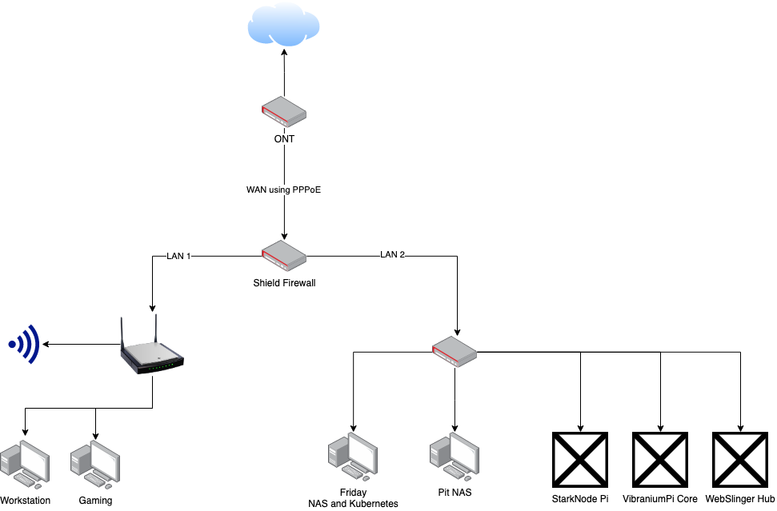

# homelab

This repo store changes of my home lab with history and store configuration of applications, servers and network

## To-Do List

- [ ] Configure Shield and Homenetwork
- [x] Create 3d Pritable NAS Case or (find one) or Find a NAS case (like jonsbo n2/n3) (I bought a Jonsbo N2)
- [ ] Build a new NAS Server
- [ ] Re-configure Friday as single node Docker server or VM Hypervisor
- [x] Create a diagram of Network
 
## Applications

| Status | App | Name | Where |
|---|---|---|---|
| Online | Plex | antinetflix | Friday (kubernetes) |
| Online | Sonarr |  | Friday (kubernetes) |
| Online | Powlarr |  | Friday (kubernetes) |
| Online | filebrowser |  | Friday (kubernetes) |
| Online | Jellyfin |  | Friday (kubernetes) |
| Online | qBittorrent |  | Friday (kubernetes) |
| Offline | Homarr |  | Friday (kubernetes) |

## Hardware

### Friday (NAS and Kubernates) Server 

- **Status:** Online
- **Operating System:** TrueNAS-SCALE-22.12.4.2
- **Processor:** AMD Ryzen 7 5700X 8-Core Processor
- **Motherboard:** MSI B450-A PRO MAX 
- **RAM:** Kingston KF3200C16D4/32GX 2 x 32 GB
- **Graphic Card:** NVIDIA GeForce GTX 1660
- **Additional Nic:** Open Smart OPS01G64NT Quad 4 Port Intel 82576EB Gigabit PCI-E X1 Ethernet
- **Disks**
  | Manufacturar | Quantity | Disk Size |
  |---|---|---|
  | Segate BarraCuda Compute | 3 | 4TB |
  | KIOXIA-EXCERIA G2 nvme SSD | 1 | 1TB |
  | SanDisk SSD PLUS  | 1 | 1TB |

### Shield

- **Status:** Idle (waiting for configuration)
- **Manufacturar:** KingnovyPC
- **Nics:** 4 x Intel i226 2.5GbE LAN
- **Ram:** 8 GB
- **Hard Disk:** 128GB SSD nvme
- **Operating System:** OPNsense

### Pit (Nas) Server

- **Status:** Idle (waiting install and configuration)
- **Motherboard:** KingnovyPC
- **Processor:** Intel N5105
- **Ram:** Kingston 2 x 4 GB
- **Hard Disk:** Kioxia Exceria NVMe 1TB 1700MB-1600MB/s M2 PCIe Nvme
- **Case:** Jonsbo N2

### Raspberry Pi's 

- **Status:** Idle (waiting for ideas)
- **Model:** 3 x Raspberry Pi 4 8 GB 
- **Names:**
  - StarkNode Pi
  - VibraniumPi Core
  - WebSlinger Hub

### Network Diagram

